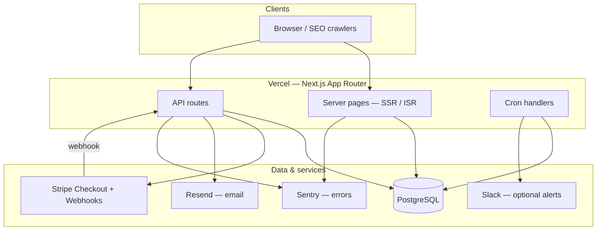
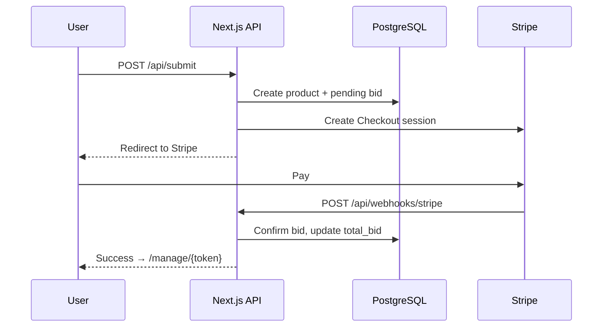

# KINGOF 👑

**Competitive product leaderboard** — products pay to climb the ranks, get discovered, and compete for the crown in every category.

- **Production:** [kingof.lol](https://kingof.lol)
- **Local dev:** [http://localhost:3000/en](http://localhost:3000/en)

This document is written for **everyone on the team** — product, design, ops, and engineering. Skim the sections you need; technical setup starts at [Quick start](#quick-start).

---

## Table of contents

1. [What is KINGOF?](#what-is-kingof)
2. [How it works (user journey)](#how-it-works-user-journey)
3. [Key concepts (glossary)](#key-concepts-glossary)
4. [System design](#system-design)
5. [Tech stack](#tech-stack)
6. [Project structure](#project-structure)
7. [Quick start](#quick-start)
8. [Environment variables](#environment-variables)
9. [Database](#database)
10. [Running the app](#running-the-app)
11. [Payments & webhooks (Stripe)](#payments--webhooks-stripe)
12. [Internationalization (i18n)](#internationalization-i18n)
13. [Scripts & npm commands](#scripts--npm-commands)
14. [API routes](#api-routes)
15. [Background jobs (cron)](#background-jobs-cron)
16. [Data model](#data-model)
17. [What is live vs demo data?](#what-is-live-vs-demo-data)
18. [Release checklist (before production)](#release-checklist-before-production)
19. [Deployment](#deployment)
20. [After deploying to production](#after-deploying-to-production)
21. [Keeping README & docs up to date](#keeping-readme--docs-up-to-date)
22. [Testing & quality checks](#testing--quality-checks)
23. [Appearance (dark / light mode)](#appearance-dark--light-mode)
24. [Troubleshooting](#troubleshooting)
25. [Useful links](#useful-links)

---

## What is KINGOF?

KINGOF is a public leaderboard where **software products compete for visibility**.

- Each product belongs to a **category** (AI, Fintech, Developer Tools, etc.).
- Products are ranked by **total bid** — the cumulative amount paid to hold a position.
- Anyone can **list for free** or **bid from $5** to climb the board.
- Visitors can **discover** products (random picks, hidden gems, most clicked) and **click through** to product sites.
- Every listed product gets a **permanent page** with rank, category position, and activity.

**Business model:** one-time bid payments via Stripe. Higher total bid = higher rank. Bids are **non-refundable** (see [Rules](https://kingof.lol/en/rules)).

---

## How it works (user journey)

### For visitors

1. Land on the homepage → see the **#1 King**, runners-up (#2 / #3), category kings, and live activity.
2. Browse **categories**, **discover**, **most clicked**, or **by country**.
3. Click a product → tracked click → redirect to the product website.

### For product owners

1. Paste a URL on the homepage or `/submit`.
2. We **fetch metadata** (name, tagline, logo, suggested category).
3. Owner confirms details, chooses **free listing** or a **bid amount** (min $5).
4. If paying: **Stripe Checkout** → webhook confirms payment → rank updates.
5. Owner receives a **private management link** by email to increase bids later.

### For the team

- Rankings, activity feed, and discovery sections are **database-driven**.
- Payments are confirmed by **Stripe webhooks** (not by the browser alone).
- Scheduled jobs refresh random picks, hidden gems, and ranking snapshots.

---

## Key concepts (glossary)

| Term | Meaning |
|------|---------|
| **Bid** | Payment in **cents** (e.g. `500` = $5). Stored in `bids` table; confirmed bids increase `products.total_bid`. |
| **King** | #1 product overall or in a category. |
| **Category king** | Highest-bid product within one category. |
| **Manage token** | Secret URL token (`/manage/{token}`) — hashed in DB; never expose the hash. |
| **Latest activity** | Recent confirmed bids + new product joins (up to **5** items, refreshes every **45s** in the browser). |
| **Trending** | Products with high click velocity (up to **5** items). |
| **Random pick** | Rotating spotlight product; cron picks a new one hourly. |
| **Hidden gem** | Lower-ranked product featured for discovery; cron picks daily. |
| **Demo data** | Fallback fake activity/trending only when the DB has **zero** activity — not used for rankings. |

---

## System design

### High-level architecture



### Request flows

**Submit & pay**



**Homepage data**

| Section | Source | Refresh |
|---------|--------|---------|
| King + runners | `getTopProducts(3)` | ISR 60s |
| Stats (counts, clicks today) | DB aggregates | ISR 60s |
| Category kings, most clicked, discover | DB queries | ISR 60s |
| Trending + latest activity | `getHappeningNow(5,5)` | SSR + client poll 45s |

### Code organization

| Layer | Location | Role |
|-------|----------|------|
| **Pages** | `src/app/[locale]/` | Routes, metadata, server data fetching |
| **Components** | `src/components/` | UI (React) |
| **Domains** | `src/domains/` | Business logic (payments, email, clicks, discovery, SEO) |
| **Queries** | `src/domains/leaderboard/queries.ts` | Leaderboard & activity SQL |
| **DB** | `src/db/` | Drizzle schema, connection, seed |
| **i18n** | `src/i18n/` | Locales, routing, message loading |
| **Lib** | `src/lib/` | URL normalization, metadata parsing, formatting |

---

## Tech stack

| Area | Technology |
|------|------------|
| Framework | [Next.js 16](https://nextjs.org) (App Router) |
| Language | TypeScript |
| UI | React 19, Tailwind CSS 4 |
| i18n | [next-intl](https://next-intl.dev) — 10 locales |
| Database | PostgreSQL + [Drizzle ORM](https://orm.drizzle.team) |
| Payments | [Stripe](https://stripe.com) Checkout |
| Email | [Resend](https://resend.com) |
| Hosting | [Vercel](https://vercel.com) |
| Analytics | Vercel Analytics |
| Errors | Sentry (optional locally) |
| Tests | Vitest |

---

## Project structure

```
kingof/
├── src/
│   ├── app/
│   │   ├── [locale]/          # Localized pages (en, de, fr, …)
│   │   ├── api/               # REST API routes
│   │   └── manage/            # Product owner dashboard (token auth)
│   ├── components/            # React UI components
│   ├── domains/               # Business logic by domain
│   │   ├── clicks/
│   │   ├── discovery/
│   │   ├── email/
│   │   ├── leaderboard/
│   │   ├── marketing/
│   │   └── payments/
│   ├── db/
│   │   ├── schema.ts          # Table definitions
│   │   ├── seed.ts            # Local sample data
│   │   └── index.ts
│   ├── i18n/
│   │   ├── locales/           # en, zh, es, ar, hi, fr, de, ja, ko, pt
│   │   └── config.ts
│   └── lib/                   # Shared utilities
├── scripts/
│   ├── validate-i18n.ts
│   ├── fill-locale-gaps.mjs
│   └── patch-rules-legal.mjs
├── drizzle.config.ts
├── vercel.json                # Cron schedules, redirects, security headers (Vercel)
├── netlify.toml               # Netlify build + redirects + headers
├── netlify/functions/         # Scheduled cron pings (Netlify)
├── .env.local.example         # Copy to .env.local
└── package.json
```

### Main pages

| Path | Purpose |
|------|---------|
| `/[locale]` | Homepage — king, activity, category kings, discover |
| `/[locale]/submit` | Full submission flow |
| `/[locale]/[category]` | Category leaderboard (e.g. `/en/ai`) |
| `/[locale]/product/[slug]` | Product detail page |
| `/[locale]/categories` | All categories |
| `/[locale]/discover` | Random pick + hidden gems |
| `/[locale]/products` | All products (paginated, sorted by bid) |
| `/[locale]/new` | Products listed in the last 5 minutes |
| `/[locale]/most-clicked` | Top clicked products |
| `/[locale]/by-country` | Clicks by country |
| `/[locale]/how-it-works` | Explainer |
| `/[locale]/rules` | Rules & legal fine print |
| `/manage/[token]` | Owner dashboard (increase bid, edit listing) |

---

## Quick start

### Prerequisites

- **Node.js** ≥ 20 and **npm** ≥ 10
- **PostgreSQL** running locally (or a remote connection string)
- Accounts (for full flows): [Stripe test mode](https://dashboard.stripe.com/test/apikeys), [Resend](https://resend.com) test key

### 1. Clone and install

```bash
cd kingof
npm install
```

### 2. Configure environment

```bash
cp .env.local.example .env.local
```

Edit `.env.local` — at minimum set `DATABASE_URL`. See [Environment variables](#environment-variables).

### 3. Create database

```bash
createdb kingof   # if using local Postgres
```

### 4. Push schema and seed sample data

```bash
npm run db:setup
```

This runs `db:push` (create tables) then `db:seed` (15 categories + ~15 sample products like Stripe, ChatGPT, etc.).

The seed script prints **management links** for local testing.

### 5. Start dev server

```bash
npm run dev
```

Open [http://localhost:3000/en](http://localhost:3000/en).

If you see stale translations or `MISSING_MESSAGE` errors after pulling changes:

```bash
npm run dev:fresh   # clears .next cache and restarts
```

---

## Environment variables

Copy `.env.local.example` → `.env.local`.

| Variable | Required | Local dev | Production |
|----------|----------|-----------|------------|
| `DATABASE_URL` | **Yes** | `postgresql://localhost:5432/kingof` | Vercel Postgres / Neon / RDS connection string |
| `STRIPE_SECRET_KEY` | For payments | `sk_test_…` | `sk_live_…` (live mode) |
| `STRIPE_WEBHOOK_SECRET` | For payments | From Stripe CLI (`whsec_…`) | From Stripe dashboard → live webhook endpoint |
| `NEXT_PUBLIC_STRIPE_PUBLISHABLE_KEY` | For payments | `pk_test_…` | `pk_live_…` |
| `NEXT_PUBLIC_SITE_URL` | **Yes in prod** | `http://localhost:3000` | `https://kingof.lol` (no trailing slash) |
| `RESEND_API_KEY` | For email | `re_test_…` | `re_…` (live key; domain verified in Resend) |
| `IP_HASH_SALT` | **Yes in prod** | Any dev string | Long random secret (never reuse dev value) |
| `CRON_SECRET` | **Yes in prod** | Any dev string | Long random secret; Vercel cron uses this |
| `SLACK_WEBHOOK_URL` | Optional | Omit locally | Slack incoming webhook for cron/payment alerts |
| `NEXT_PUBLIC_SENTRY_DSN` | Optional | Omit locally | Sentry project DSN |
| `SENTRY_ORG` / `SENTRY_PROJECT` / `SENTRY_AUTH_TOKEN` | Optional | Omit locally | CI/Vercel build — uploads source maps |
| `GOOGLE_SITE_VERIFICATION` | Optional | Omit locally | Meta tag content from Search Console |
| `BING_SITE_VERIFICATION` | Optional | Omit locally | Meta tag content from Bing Webmaster |

**Never commit** `.env.local` or production secrets. Templates live in `.env.local.example` and `.env.example`.

### Production vs local — quick rules

| Setting | Local | Production |
|---------|-------|------------|
| Stripe keys | Test mode (`sk_test_`, `pk_test_`) | Live mode (`sk_live_`, `pk_live_`) |
| `NEXT_PUBLIC_SITE_URL` | `http://localhost:3000` | `https://kingof.lol` |
| Resend | Test API key | Live key + verified sending domain |
| `db:seed` | OK for local sample data | **Do not run** on production DB |
| Console logs | Visible in terminal | Stripped from client bundles (`removeConsole` in prod build) |
| Geo / by-country | No country detection on localhost | Vercel: `x-vercel-ip-country`; Netlify: `x-country` |

---

## Database

### Tools

| Tool | Command | Use case |
|------|---------|----------|
| **Drizzle Studio** | `npm run db:studio` | Browser UI to browse/edit tables ([local.drizzle.studio](https://local.drizzle.studio)) |
| **psql** | `psql postgresql://localhost:5432/kingof` | SQL shell |
| **Seed** | `npm run db:seed` | Refresh sample products (idempotent) |
| **Push schema** | `npm run db:push` | Apply schema changes without migrations |
| **Migrations** | `npm run db:migrate` | Run generated migrations (production-style) |

### Useful SQL

```sql
-- Top products by bid (amounts are in cents)
SELECT name, slug, total_bid / 100.0 AS bid_usd, status
FROM products
ORDER BY total_bid DESC
LIMIT 10;

-- Recent confirmed bids
SELECT p.name, b.amount / 100.0 AS bid_usd, b.status, b.created_at
FROM bids b
JOIN products p ON p.id = b.product_id
ORDER BY b.created_at DESC
LIMIT 10;

-- Row counts
SELECT 'products' AS t, count(*) FROM products
UNION ALL SELECT 'bids', count(*) FROM bids
UNION ALL SELECT 'clicks', count(*) FROM clicks;
```

### Tables (summary)

| Table | Purpose |
|-------|---------|
| `categories` | 15 product categories |
| `products` | Listings, bids totals, status, manage token hash |
| `bids` | Individual payments (pending → confirmed) |
| `clicks` | Outbound click tracking (IP hashed) |
| `random_picks` | Current random spotlight rotation |
| `hidden_gem_picks` | Current hidden gem feature |
| `ranking_snapshots` | Hourly rank history |
| `webhook_events` | Stripe idempotency log |
| `metadata_cache` | Cached URL metadata fetches |
| `sponsors` | Sponsored placement windows |

Schema source of truth: `src/db/schema.ts`.

---

## Running the app

| Command | Description |
|---------|-------------|
| `npm run dev` | Development server (Turbopack) |
| `npm run dev:fresh` | Clear `.next` + dev (fixes cache issues) |
| `npm run build` | Production build |
| `npm run start` | Run production build locally |
| `npm run verify` | Full CI check: format, lint, types, tests, i18n, build |

---

## Payments & webhooks (Stripe)

### Local webhook testing

1. Install [Stripe CLI](https://stripe.com/docs/stripe-cli).
2. Forward events to your local server:

```bash
stripe listen --forward-to localhost:3000/api/webhooks/stripe
```

3. Copy the printed `whsec_…` into `.env.local` as `STRIPE_WEBHOOK_SECRET`.
4. Use test card `4242 4242 4242 4242` in Checkout.

### Payment rules (product)

- Minimum bid: **$5** (`500` cents).
- Free listing: bid `0` — product is approved without Stripe.
- Bids are **non-refundable**; rules may change (see `/rules`).
- Adult/sexual sites are banned without refund.

---

## Internationalization (i18n)

- **10 locales:** `en`, `zh`, `es`, `ar`, `hi`, `fr`, `de`, `ja`, `ko`, `pt`
- Messages: `src/i18n/locales/{locale}/app.json` and `common.json`
- English is the fallback for missing keys (`src/i18n/load-messages.ts`)
- URLs always include locale: `/en/…`, `/de/…`, etc.
- Arabic (`ar`) is RTL

### Adding or changing copy

1. Edit `src/i18n/locales/en/app.json` (or `common.json`).
2. Run `npm run validate:i18n` — fails if other locales are missing keys.
3. Use `scripts/fill-locale-gaps.mjs` to propagate new keys to other locales when needed.

**Rule:** No hardcoded user-facing strings in components — use `useTranslations` / `getTranslations`.

---

## Scripts & npm commands

| Script | Description |
|--------|-------------|
| `npm run dev` | Start dev server |
| `npm run dev:fresh` | Clear cache + dev |
| `npm run build` | Production build |
| `npm run test` | Vitest unit tests |
| `npm run lint` | ESLint |
| `npm run typecheck` | TypeScript check |
| `npm run format` | Prettier write |
| `npm run format:check` | Prettier check |
| `npm run db:setup` | Push schema + seed |
| `npm run db:push` | Sync schema to DB |
| `npm run db:seed` | Insert/update sample data |
| `npm run db:studio` | Open Drizzle Studio |
| `npm run db:generate` | Generate Drizzle migrations |
| `npm run db:migrate` | Run migrations |
| `npm run validate:i18n` | Check all locale files |
| `npm run verify` | Run everything before merge |

---

## API routes

| Method | Path | Purpose |
|--------|------|---------|
| `GET` | `/api/products/list` | Paginated product list (`sort=bid\|new`) |
| `GET` | `/api/activity` | Trending + latest activity (JSON) |
| `GET` | `/api/categories` | Category list |
| `POST` | `/api/submit` | Create product + Stripe session |
| `POST` | `/api/products/preview` | Fetch URL metadata |
| `GET` | `/api/products/random` | Next random pick |
| `GET` | `/api/products/hidden-gem` | Current hidden gem |
| `GET` | `/api/products/rank-preview` | Estimate rank for bid amount |
| `GET` | `/api/click/[productId]` | Track click + redirect |
| `GET` | `/api/top-by-country` | Leaderboard by visitor country |
| `GET/POST` | `/api/manage/[token]` | Owner read/update listing |
| `POST` | `/api/manage/[token]/increase-bid` | New Stripe session for top-up |
| `POST` | `/api/webhooks/stripe` | Stripe payment confirmation |
| `GET` | `/api/cron/snapshots` | Daily rank snapshots |
| `GET` | `/api/cron/random-picks` | Daily random pick rotation |
| `GET` | `/api/cron/hidden-gems` | Daily hidden gem pick |

Cron routes require `Authorization: Bearer {CRON_SECRET}` when the secret is set.

---

## Background jobs (cron)

Configured in `vercel.json`:

| Job | Schedule | Purpose |
|-----|----------|---------|
| `/api/cron/snapshots` | Daily 00:00 UTC (`0 0 * * *`) | Save rank history |
| `/api/cron/random-picks` | Daily 01:00 UTC (`0 1 * * *`) | Rotate random spotlight |
| `/api/cron/hidden-gems` | Daily 06:00 UTC (`0 6 * * *`) | Pick new hidden gem |

**Vercel Hobby** allows only **once-per-day** cron schedules. Hourly jobs (`0 * * * *`) require **Pro**. Netlify scheduled functions (in `netlify/functions/`) can still run hourly on staging if needed.

Failures optionally notify Slack (`SLACK_WEBHOOK_URL`).

---

## Data model

**Money is stored in cents** everywhere (`total_bid`, `bids.amount`). Display uses `formatBid()` → `$150` for `15000`.

**Product status:** `pending` → `approved` | `disabled`

**Bid status:** `pending` → `confirmed` (via Stripe webhook)

**Rankings:** Computed at query time from `total_bid` among `approved` products (overall and per category).

---

## What is live vs demo data?

| Data | Source |
|------|--------|
| King, runners, category kings, most clicked, discover, stats | **PostgreSQL** (real) |
| Trending + latest activity | **PostgreSQL** when any activity exists |
| Trending + latest activity (empty DB) | **Demo fallback** (`src/lib/demo-data.ts`) — filler only |
| Seed products (Stripe, ChatGPT, …) | **Local dev seed** — real DB rows, not hardcoded in UI |

If the database has products, you see real data. Demo names (NeuralForge, PayFlow, etc.) only appear when the activity feed is completely empty.

---

## Release checklist (before production)

Run this **before every production deploy** (or before merging to the branch Vercel deploys from).

### 1. Code quality (local)

```bash
npm run verify
```

This runs, in order: Prettier → ESLint → TypeScript → Vitest → i18n validation → production build.

Fix anything that fails. Do not deploy with a red `verify`.

### 2. Environment variables (Vercel dashboard)

In **Vercel → Project → Settings → Environment Variables**, confirm **Production** has:

| Variable | Must be set? | Production value |
|----------|--------------|------------------|
| `DATABASE_URL` | Yes | Production Postgres URL |
| `NEXT_PUBLIC_SITE_URL` | Yes | `https://kingof.lol` |
| `STRIPE_SECRET_KEY` | Yes (if taking payments) | `sk_live_…` |
| `NEXT_PUBLIC_STRIPE_PUBLISHABLE_KEY` | Yes | `pk_live_…` |
| `STRIPE_WEBHOOK_SECRET` | Yes | Live webhook signing secret |
| `RESEND_API_KEY` | Yes (if sending email) | Live Resend key |
| `IP_HASH_SALT` | Yes | Unique production secret |
| `CRON_SECRET` | Yes | Unique production secret |
| `NEXT_PUBLIC_SENTRY_DSN` | Recommended | Sentry DSN |
| `SLACK_WEBHOOK_URL` | Recommended | For payment/cron failure alerts |

Use **Preview** env for staging if you have a preview deployment — never point preview at the production database.

### 3. Database (first deploy or after schema changes)

Against the **production** `DATABASE_URL` (from your machine or CI, not from Vercel logs):

```bash
# First time or after pulling schema changes
DATABASE_URL="postgresql://..." npm run db:push
# OR, if you use generated migrations:
DATABASE_URL="postgresql://..." npm run db:migrate
```

**Never** run `npm run db:seed` against production — that inserts demo products.

### 4. Stripe (live mode)

1. [Stripe Dashboard → Developers → Webhooks](https://dashboard.stripe.com/webhooks) → **Add endpoint**
2. URL: `https://kingof.lol/api/webhooks/stripe`
3. Events: at minimum `checkout.session.completed`
4. Copy the **Signing secret** → `STRIPE_WEBHOOK_SECRET` in Vercel
5. Confirm live API keys are in Vercel (not test keys)

### 5. Resend (email)

1. Verify your sending domain in [Resend](https://resend.com/domains)
2. Set live `RESEND_API_KEY` in Vercel
3. Test after deploy: submit a product and confirm the management-link email arrives

### 6. Cron

`vercel.json` already defines three cron jobs. On Vercel Pro+, they run automatically. Ensure `CRON_SECRET` is set — routes reject unauthorized calls when it is present.

### 7. README & docs sanity check

Before shipping, confirm docs still match the app:

- [ ] **README.md** — routes table matches `src/app/[locale]/` (new pages like `/products`, `/new`?)
- [ ] **Environment variables** — any new `process.env.*` added to code is listed in README + `.env.example`
- [ ] **API routes** — new routes under `src/app/api/` documented in [API routes](#api-routes)
- [ ] **i18n** — new user-facing strings added to all 10 locales (`npm run validate:i18n`)
- [ ] **Cron** — new jobs added to `vercel.json` and README cron table

See [Keeping README & docs up to date](#keeping-readme--docs-up-to-date) for the full doc-update workflow.

---

## Deployment

Built for **Vercel** — the code assumes it: `vercel.json` defines cron schedules, the `www` → apex redirect, and security headers; cron routes expect Vercel's `Authorization: Bearer` cron pattern.

### Deploy steps

1. Complete the [Release checklist](#release-checklist-before-production) above.
2. Connect the Git repo to Vercel (or push to the production branch).
3. Set all production [environment variables](#environment-variables) in Vercel **before** the first deploy.
4. Run `db:push` or `db:migrate` against the production database.
5. Deploy (automatic on push, or manual redeploy in Vercel).
6. Run the [After deploying](#after-deploying-to-production) smoke tests.

`www.kingof.lol` redirects to `kingof.lol` (configure in **Vercel → Domains**: apex = Production, www = permanent redirect to apex).

### What Vercel sets automatically

You do **not** need to configure these manually on Vercel:

- `NODE_ENV=production` — enables production build (console stripped from client bundles)
- `x-vercel-ip-country` — used for by-country leaderboards and click geo
- Cron `Authorization` header — Vercel sends `Bearer {CRON_SECRET}` when `CRON_SECRET` is set

### Alternative: Netlify (dual deploy)

You can deploy the **same Git repo** to both Vercel and [Netlify](https://app.netlify.com/) on every push. Use **one platform for production** (`kingof.lol` on Vercel) and Netlify for staging/backup on a Netlify URL.

#### What's included in the repo

| File | Purpose |
|------|---------|
| `netlify.toml` | Build command, `@netlify/plugin-nextjs`, `www` redirect, security headers |
| `netlify/functions/cron-*.mts` | Scheduled jobs that ping `/api/cron/*` (same schedule as `vercel.json`) |

#### Netlify setup (first time)

1. Go to [app.netlify.com](https://app.netlify.com/) → **Add new site** → **Import from Git**
2. Select the same repo and branch as Vercel
3. Netlify reads `netlify.toml` automatically — no manual build settings needed
4. **Site settings → Environment variables** — copy every var from [Environment variables](#environment-variables) (Netlify does not read `.env.local`)
5. Deploy — your site will be at `https://<name>.netlify.app`
6. **Do not** point `kingof.lol` DNS at Netlify unless you are migrating off Vercel

#### Dual-deploy rules

| | Vercel (production) | Netlify (staging) |
|--|---------------------|-------------------|
| Domain | `kingof.lol` | `*.netlify.app` or staging subdomain |
| Stripe | Live keys + webhook → `kingof.lol/api/webhooks/stripe` | Test keys, or a **second** webhook for the Netlify URL |
| Database | Production Postgres | Staging DB recommended (or same DB only if you accept shared data) |
| Cron | `vercel.json` (automatic) | `netlify/functions/cron-*.mts` (automatic when `CRON_SECRET` is set) |
| Geo / by-country | `x-vercel-ip-country` | `x-country` (supported in code) |

#### If Netlify build fails

- **`publish directory cannot be the same as the base directory`** — In Netlify UI go to **Site configuration → Build & deploy → Build settings** and **clear** the Publish directory field (leave empty), or rely on `publish = ".next"` in `netlify.toml`. Never set publish to `/` or the repo root.
- Confirm `@netlify/plugin-nextjs` is in `package.json` (installed as devDependency)
- Check deploy log for missing env vars (especially `DATABASE_URL`)
- If every path 404s after a green build, try `https://your-site.netlify.app/en` (locales are always prefixed)

---

## After deploying to production

Run this smoke test **immediately after** a production deploy (or after changing env vars / Stripe / DB).

### Automated

```bash
# From your machine — should return 200
curl -s -o /dev/null -w "%{http_code}" https://kingof.lol/en
curl -s -o /dev/null -w "%{http_code}" https://kingof.lol/en/submit
curl -s -o /dev/null -w "%{http_code}" https://kingof.lol/en/products
```

### Manual checklist

| Check | How | Expected |
|-------|-----|----------|
| Homepage loads | Open `https://kingof.lol/en` | King, categories, activity visible |
| Locales | Spot-check `/de`, `/ja` | Translated UI, no `MISSING_MESSAGE` |
| Submit flow | `/en/submit` → paste URL → free list | Success; management email received |
| Paid bid | Submit with $5+ bid | Redirects to Stripe **live** Checkout |
| Stripe webhook | Complete a live/test payment | Product rank updates; bid `confirmed` in DB |
| Product page | Click through from leaderboard | `/en/product/{slug}` loads |
| Click tracking | Click a product outbound link | Row in `clicks` table; geo on Vercel |
| By country | `/en/by-country` | Country picker works; data after real clicks |
| Cron | Vercel → Cron logs (next hour) | `snapshots`, `random-picks` succeed |
| Errors | Sentry dashboard | No spike in new errors |
| SEO | `https://kingof.lol/sitemap.xml` | Lists main routes |
| Security | Browser devtools console | No app secrets or debug logs leaked |

### If something fails after deploy

1. **Vercel → Deployments → Logs** — build or runtime errors
2. **Stripe → Webhooks** — delivery failures for `/api/webhooks/stripe`
3. **Resend → Logs** — email bounces or API errors
4. **Sentry** — stack traces (if DSN configured)
5. Roll back deployment in Vercel if critical; fix forward on a new deploy

---

## Keeping README & docs up to date

There is only one project README (`README.md`). Update it **in the same PR** when you change behavior that operators or new teammates need to know.

### When to update README

| You changed… | Update in README |
|--------------|------------------|
| New page under `src/app/[locale]/` | [Main pages](#main-pages) table |
| New API route | [API routes](#api-routes) table |
| New env var in code | [Environment variables](#environment-variables) + `.env.example` |
| New cron job | [Background jobs](#background-jobs-cron) + `vercel.json` |
| New npm script | [Scripts & npm commands](#scripts--npm-commands) |
| New locale or i18n workflow | [Internationalization](#internationalization-i18n) |
| Deploy / hosting steps | [Release checklist](#release-checklist-before-production) or [Deployment](#deployment) |
| Payment or email flow | [Payments & webhooks](#payments--webhooks-stripe) |

### How to verify docs are current (before merge)

```bash
# 1. Full quality gate
npm run verify

# 2. i18n keys match across all locales
npm run validate:i18n

# 3. Env template matches code — search for new env usage:
rg "process\.env\." src --no-heading | sort -u
# Compare output to README env table and .env.example

# 4. Routes — list app pages and compare to README "Main pages"
find src/app/\[locale\] -name page.tsx | sort

# 5. API routes — list and compare to README "API routes"
find src/app/api -name route.ts | sort
```

### PR checklist (copy into description)

```markdown
- [ ] `npm run verify` passes
- [ ] README updated (routes / env / API / deploy) if behavior changed
- [ ] `.env.example` updated if new env vars added
- [ ] All 10 locales updated (`npm run validate:i18n`)
- [ ] Production env vars noted for ops (if new secrets)
```

### Who updates what

| Audience | Document |
|----------|----------|
| Engineers | `README.md`, `.env.example`, code comments for non-obvious logic |
| Operators / deploy | [Release checklist](#release-checklist-before-production), Vercel env dashboard |
| Product / copy | `src/i18n/locales/en/app.json` (+ propagate to other locales) |
| Legal / rules | `/en/rules` content in locale files |

---

## Testing & quality checks

```bash
npm run test              # Vitest — unit + integration (251 tests)
npm run test:coverage     # Same suite with 100% coverage gate (lib + domains + db)
npm run test:seo          # Post-build SEO checks (runs after `npm run build`)
npm run validate:i18n     # All 10 locales complete
npm run verify            # Full CI pipeline locally (format → lint → types → coverage → i18n → build → SEO)
```

**Coverage scope:** `src/lib/**`, `src/domains/**`, `src/db/index.ts` (schema/seed excluded). **100%** statements, branches, functions, and lines enforced in CI.

**CI:** GitHub Actions (`.github/workflows/ci.yml`) runs on every push/PR to `main`: Prettier → ESLint → TypeScript → `test:coverage` → i18n → production build → SEO tests. Coverage artifact uploaded for 7 days.

**Deploy builds:** Vercel and Netlify run `npm run build` only — no tests in deploy. Test files are excluded via `.vercelignore` and are never part of the Next.js bundle.

| When | Command |
|------|---------|
| Every PR | `npm run verify` (or rely on GitHub Actions) |
| Quick iteration | `npm run typecheck` + `npm run test` |
| Copy changes only | `npm run validate:i18n` |
| Before production deploy | Full [Release checklist](#release-checklist-before-production) |

Before opening a PR, run `npm run verify` locally. Before deploying to production, run `verify` on the commit you are about to ship.

---

## Appearance (dark / light mode)

- **Default:** dark mode (current brand look).
- **Toggle:** sun/moon button in the nav bar (desktop + mobile menu).
- **Persistence:** `localStorage` key `kingof-theme` (`dark` | `light`).
- **Implementation:** CSS variables on `[data-theme]` in `src/app/globals.css`; inline init script in `src/app/layout.tsx` prevents flash on load.

---

## Troubleshooting

| Problem | Fix |
|---------|-----|
| `MISSING_MESSAGE` in console | Run `npm run dev:fresh` — stale Turbopack cache |
| Empty homepage | Run `npm run db:setup` — need seeded or real products |
| Stripe webhook not firing locally | Run `stripe listen --forward-to localhost:3000/api/webhooks/stripe` |
| `DATABASE_URL is not set` | Copy `.env.local.example` → `.env.local` |
| Drizzle Studio won't connect | Check Postgres is running: `pg_isready` |
| Bid shows wrong dollar amount | Remember DB stores **cents**; divide by 100 |
| Activity not updating live | Polls every **45s** — not WebSockets; refresh or wait |
| i18n validation fails | Add missing keys to all locale files or run fill script |
| Submit shows success but 404 on product | API may have failed — check Stripe/DB; paid listings stay `pending` until webhook |
| By country empty locally | Normal — needs Vercel geo headers + real clicks with `country_code` |
| Console logs in production | Client `console.*` is stripped in prod builds; use Sentry for errors |

---

## Useful links

| Resource | URL |
|----------|-----|
| Production site | https://kingof.lol |
| Stripe test dashboard | https://dashboard.stripe.com/test |
| Resend | https://resend.com |
| Drizzle docs | https://orm.drizzle.team/docs/overview |
| next-intl docs | https://next-intl.dev |
| Vercel cron docs | https://vercel.com/docs/cron-jobs |

---

## Questions?

- **Product / rules / copy** → check `/en/how-it-works` and `/en/rules` on the site, or locale files in `src/i18n/locales/en/`.
- **Data / rankings** → Drizzle Studio or `psql` (see [Database](#database)).
- **Code / architecture** → `src/domains/` and `src/domains/leaderboard/queries.ts`.
